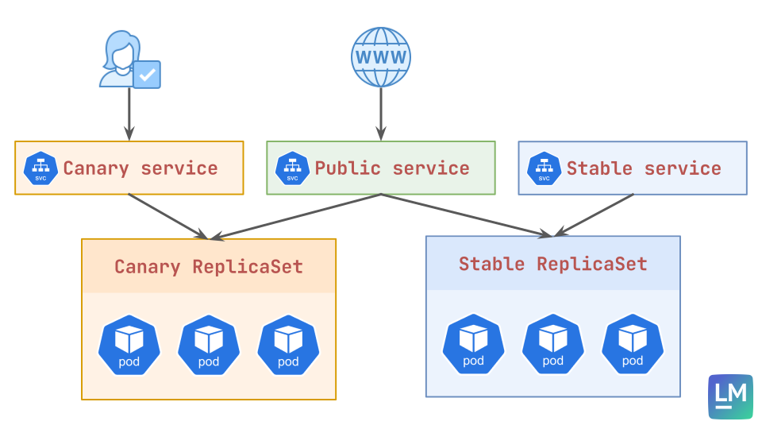

## 🎯 Lab Goal

Configure an advanced Canary rollout that creates dedicated endpoints for the "Canary" and "Stable" versions, enabling precise verification while simultaneously serving mixed traffic to users.

## 📝 Overview & Concepts

In this advanced lab, we go beyond simple replica weighting. We will configure a Rollout that manages **three** distinct Kubernetes Services:

1.  **`rollout-canary-public`**: The standard service that load balances across ALL pods. At the 20% step, this service provides the 80/20 traffic split based on the number of replicas.
2.  **`rollout-canary-preview`**: A dedicated service that Argo Rollouts will constrain to ONLY target the new "Canary" pods.
3.  **`rollout-canary-stable`**: A dedicated service that Argo Rollouts will constrain to ONLY target the old "Stable" pods.

You will see how Argo Rollouts dynamically modifies the `spec.selector` of the preview and stable services to pin them to specific revisions, allowing you to "smoke test" the new version in isolation before promoting it.

### Architecture Diagram

## 📋 Lab Tasks

1.  Create a `services.yaml` file defining three Services: `rollout-canary-public`, `rollout-canary-preview`, and `rollout-canary-stable`. All should initially point to `app: rollout-canary`.
2.  Create a `rollout.yaml` with 10 replicas.
3.  Configure the `strategy.canary` block to include:
    - `canaryService: rollout-canary-preview`
    - `stableService: rollout-canary-stable`
    - Steps: `setWeight: 20`, `pause: {}`, `setWeight: 50`, `pause: {duration: 10s}`.
4.  Deploy Version 1. Verify all three services work.
5.  Update to Version 2.
6.  **The Critical Verification:** When the rollout pauses at 20%:
    - Use `kubectl get endpoints` to see that `preview` points to 2 IPs, `stable` points to 8 IPs, and `public` points to 10 IPs.
    - Use `kubectl port-forward` or `minikube service` to hit the `preview` service and confirm it **always** returns Version 2.
    - Use `kubectl port-forward` or `minikube service` to hit the `public` service and confirm it returns a mix.
7.  Promote the rollout and watch the transition.

## 📚 Helpful Resources

- [Argo Rollouts - Canary Strategy](https://argo-rollouts.readthedocs.io/en/stable/features/canary/)

## 💭 Reflection Questions

1.  How does Argo Rollouts ensure the `preview` service only targets the new pods? (Hint: Check the Service selectors during a rollout).
2.  Why might you want a dedicated `stable` service in addition to the `public` service?
3.  If you were using an Ingress controller or Service Mesh (like Istio or ALB), how would the role of the `public` service change regarding traffic splitting?
