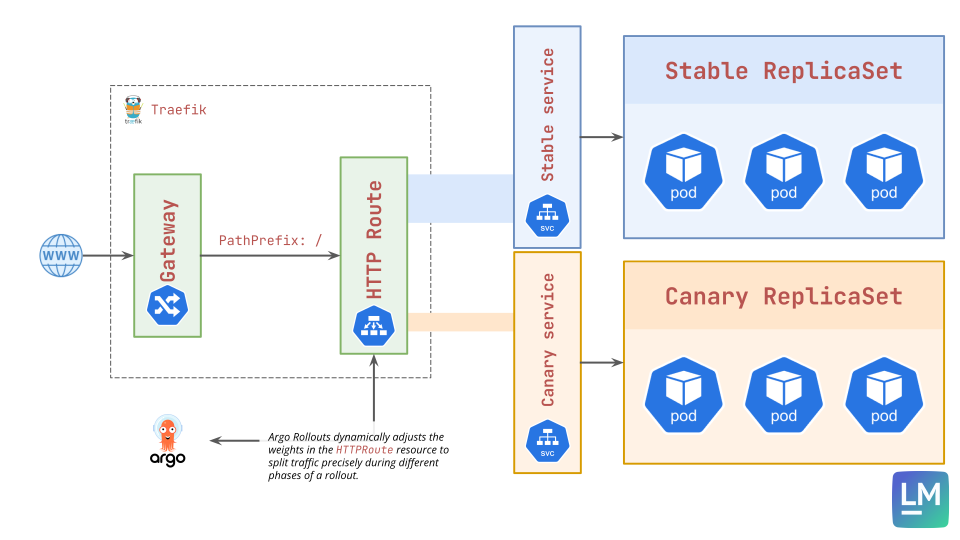

## 🎯 Lab Goal

Configure and execute a Traffic-Weighted Canary deployment using the **Kubernetes Gateway API**, achieving precise traffic splitting decoupled from replica counts.

## 📝 Overview & Concepts

In this lab, we will implement the architecture we discussed in the theory lecture. We will create the necessary Gateway API resources (`Gateway` and `HTTPRoute`) to route traffic to our application.

Then, we will define a `Rollout` that uses the `trafficRouting` block to control that `HTTPRoute`. Unlike previous labs, you will see that even with only **1 canary pod**, we can send exactly **5%** of traffic to it.

### Architecture Diagram



## 📋 Lab Tasks

1.  Create a new namespace `gateway-lab`.
2.  Create a `services.yaml` file defining two Services: `rollout-gateway-stable` and `rollout-gateway-canary`. Both should point to `app: rollout-gateway`.
3.  Create a `gateway.yaml` file defining:
    - A `Gateway` resource listening on port 80.
    - An `HTTPRoute` resource pointing to the stable and canary services.
4.  Create a `rollout.yaml` configured with:
    - `trafficRouting` using the `gatewayAPI` provider.
      ```yaml
      strategy:
        canary:
          canaryService: rollout-gateway-canary
          stableService: rollout-gateway-stable
          trafficRouting:
            plugins:
              argoproj-labs/gatewayAPI:
                httpRoute: rollout-gateway-route # our created httproute
                namespace: gateway-lab # namespace where this rollout resides
      ```
    - Steps:
      - Set the weight to 30% and pause indefinitely
      - Set the weight to 40% and pause for 20 seconds
      - Set the weight to 60% and pause for 20 seconds
      - Set the weight to 80% and pause for 20 seconds
5.  Apply the manifests to deploy **Version 1**.
6.  Deploy a **Version 2** by changing the APP_COLOR environment variable.
7.  **Verify Precision:**
    - Observe the Rollout pausing at the 30% step.
    - Use `kubectl get httproute ... -o yaml` to inspect the live route configuration and confirm the weights are exactly `70` and `30`.
8.  Promote the rollout to completion.

## 📚 Helpful Resources

- [Gateway API - HTTPRoute](https://gateway-api.sigs.k8s.io/api-types/httproute/)
- [Argo Rollouts - Traffic Routing](https://argo-rollouts.readthedocs.io/en/stable/features/traffic-management/)

## 💭 Reflection Questions

1.  Why is traffic weighting via Gateway API/Ingress superior to replica-based weighting for low-traffic or small-scale services?
2.  What happens to the `HTTPRoute` weights when the rollout is fully promoted?
3.  How does Argo Rollouts know which Service in the `HTTPRoute` corresponds to the "canary" and which to the "stable"?
